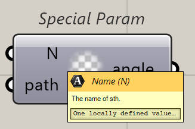
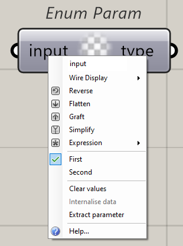
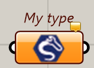
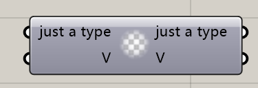
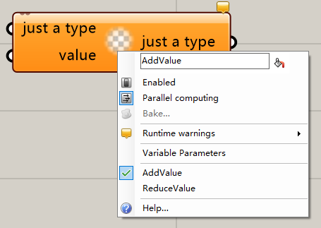

# Simple Grasshopper

Hi, this is a repo to simplify your plugin development in Grasshopper.

With this repo, you don't need to understand what a `GH_Component` is and what a `GH_Param` is. All you need to do is add attributes!

NOTICE: For some reason, the `SimpleGrasshopper.dll` and `Newtonsoft.Json` won't copy to the output directory automatically. If there is any way to make the nuget package only copy this file, please tell me.

## Quick Start

Add the package from nuget package.

```html
  <ItemGroup>
    <PackageReference Include="SimpleGrasshopper" Version="0.9.1" />
  <ItemGroup>
```

Don't forget to copy this `SimpleGrasshopper.dll` file to your output folder!


Notice: if you want to create a plugin in rhino8 with .Net core, please add a `Grasshoppper` reference to your project!

If you want to see more examples, please go [here](https://github.com/ArchiDog1998/SimpleGrasshopper/tree/main/SimpleGrasshopper.GHTests).

## How to use

### Component

All the components are methods. to simplify creating these things, a method is a component! To let it know which method should be the component, please tag it with `DocObjAttribute` with the basic info about it called `Name`, `NickName`, and `Description`!

``` c#
using SimpleGrasshopper.Attributes;

namespace SimpleGrasshopper.GHTests;

internal class SimpleSubcategory
{
    [DocObj("Addition", "Add", "The addition of the integers.")]
    private static void SimpleMethod(int a, int b, out int c)
    {
        c = a + b;
    }
}
```

Now, you'll see a component in GH!


The parameters can be `in`, `out,` or `ref`.

The method can be `static` or not. If it is not static, it'll create an input and an output to the instance of that class.

#### Component Infos

For some cases, you may want to add more information for this component, there are 3 attributes designed for this. They are `SubCategoryAttribute`, `IconAttribute`, and `ExposureAttribute`. You can also use the attribute `ObsoleteAttribute`.

``` c#
using SimpleGrasshopper.Attributes;

namespace SimpleGrasshopper.GHTests;

[SubCategory("Just a test")]
internal class SimpleSubcategory
{
    [Icon("ConstructRenderItemComponent_24-24.png")] // The name of the png that is embedded in your dll or the download link or the local path even the guid of some component to get the icon from it.
    [Exposure(Grasshopper.Kernel.GH_Exposure.secondary)]
    [DocObj("Addition", "Add", "The addition of the integers.")]
    private static void SimpleMethod(int a, int b, out int c)
    {
        c = a + b;
    }
}
```

#### Parameters Info

If you want to change the description of the param, please use `DocObjAttribute` one more time to make it easier to read.

If you want to use some other Parameter with your parameter, please use `ParamAttribute`.

For the angle parameter, is the `AngleAttribute`!

For the geometry parameter, if you want to hide it, please use `HiddenAttribute`!

If your parameter is `int` or `double`, you can add `RangeAttribute` to control the range of it. It'll automatically make the input value in this range, and make a warning to Grasshopper.

```c#
using SimpleGrasshopper.Attributes;
using SimpleGrasshopper.Data;

namespace SimpleGrasshopper.GHTests;

[SubCategory("Just a test")]
internal class SimpleSubcategory
{
    [DocObj("Special Param", "Spe", "Special Params")]
    private static void ParamTest(
        [DocObj("Name", "N", "The name of sth.")] string name, 
        [Param(ParamGuids.FilePath)]string path,
        [Angle]out double angle)
    {
        angle = Math.PI;
    }
}
```




#### Data Access

If you want your data access to be a list, please set the param type to `List<T>` or `T[]`.

If you want your data access to be a tree. That would be complex.

If it is a built-in type, please do it like `GH_Structure<GH_XXXX>`. If it is your type, please do it like `GH_Structure<SimpleGoo<XXXXX>>`.

#### Enum Type

You may want to add some enum parameters to your project in some cases, so just do it!

You can also add a default value for making it optional.

``` c#
using SimpleGrasshopper.Attributes;
using SimpleGrasshopper.Data;

namespace SimpleGrasshopper.GHTests;

[SubCategory("Just a test")]
internal class SimpleSubcategory
{
    [DocObj("Enum Param", "Enu", "Enum testing")]
    private static void EnumTypeTest(out EnumTest type, EnumTest input = EnumTest.First)
    {
        type = EnumTest.First;
    }
}

public enum EnumTest : byte
{
    First,
    Second,
}

```




### Parameters

For parameters, they are just types! doing things like a type!

You can also add `IconAttribute` , `ExposureAttribute`, and  `ObsoleteAttribute`.

``` c#
using SimpleGrasshopper.Attributes;

namespace SimpleGrasshopper.GHTests;

[Icon("CurveRenderAttributeParameter_24-24.png")]
[DocObj("My type", "just a type", "Testing type.")]
public class TypeTest
{
}

```



And this parameter can also be used in the component!

```c#
using SimpleGrasshopper.Attributes;
using SimpleGrasshopper.Data;

namespace SimpleGrasshopper.GHTests;

[SubCategory("Just a test")]
internal class SimpleSubcategory
{
    [DocObj("Type Testing", "T", "Testing for my type")]
    private static void MyTypeTest(TypeTest type)
    {

    }
}

```


If you want your parameter can be previewed, please add the interface `IPreviewData`. If you want your data can be baked, please add the interface `IGH_BakeAwareData`.

If you want your type can be converted, please do it with [explicit and implicit conversion operators](https://learn.microsoft.com/en-us/dotnet/csharp/language-reference/operators/user-defined-conversion-operators).

### Special Components

For some common components, there are some ez ways to create them.

#### Property Component

If you create your data type, and you want to modify its property, you can add a tag called `PropertyComponentAttribute` to your type definition.



``` c#
[PropertyComponent]
[Icon("CurveRenderAttributeParameter_24-24.png")]
[DocObj("My type", "just a type", "Testing type.")]
public class TypeTest
{
    [DocObj("Value", "V", "")]
    public int FirstValue { get; set; }
}
```

#### Type Component

If you are soo lazy to add a lot of tags to every method in one type. You can add a tag called `TypeComponentAttribute`. It'll create a method component for your plugin, and this component can use all public methods.



``` c#
[TypeComponent]
[Icon("CurveRenderAttributeParameter_24-24.png")]
[DocObj("My type", "just a type", "Testing type.")]
public class TypeTest
{
    [DocObj("Value", "V", "")]
    public int FirstValue { get; set; }

    public void AddValue(int value)
    {
        FirstValue += value;
    }

    public void ReduceValue(int value)
    {
        FirstValue -= value;
    }
}
```

Well, good news for all lazy people!

### Settings

Well, for some lazy people like me, who don't like to use `Instances.Setting.GetValue(XXX)`, etc. I just want to make it ez.

So, just tag a static field with the attribute `SettingAttribute`!

``` c#
using SimpleGrasshopper.Attributes;
using System.Drawing;

namespace SimpleGrasshopper.GHTests;

internal static partial class SettingClass
{
    [Setting]
    private static readonly bool firstSetting = true;

    [Setting]
    private static readonly Color secondSetting = Color.AliceBlue;
}

internal readonly partial struct SettingStruct
{
    [Setting]
    private static readonly string anotherSetting = default!;
}
```

And you can use it like this.

```c#
var a = SettingClass.FirstSetting;
var b = SettingClass.SecondSetting;
var c = SettingStruct.AnotherSetting;
```

That makes it easier!

#### Configurations

If you want to add your custom menu to Grasshopper. You can add a tag called `ConfigAttribute` to your setting or your property.

### Advanced

So it is making it easier. But if you still want to modify the `GH_Component` or `GH_PersistentParam`. You can use the keyword `partial` to modify the class. For the components, the class is `CLASSNAME_METHODNAME_Component`. For the parameters, the class is `CLASSNAME_Parameter`.
