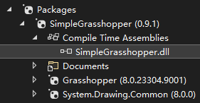
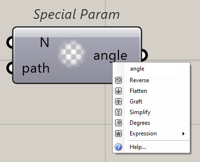

# Simple Grasshopper

Hi, this is a repo to simplify your plugin development in Grasshopper.

With this repo, you don't need to understand what a `GH_Component` is and what a `GH_Param` is. All you need to do is add attributes!

NOTICE: For some reason, the `SimpleGrasshopper.dll` won't copy to the output directory automatically. If there is any way to make the nuget pacakge only copy this file, please tell me.

## Quick Start

Add the package from nuget package.

```html
  <ItemGroup>
    <PackageReference Include="SimpleGrasshopper" Version="0.9.1" />
  <ItemGroup>
```

Don't forget to copy this `SimpleGrasshopper.dll` file to your output folder!



## How to use

### Component

All the components are methods. to simplify creating these things, a method is a component! To let it know which method should be the component, please tag it with `DocObjAttribute` with the basic info about it called `Name`, `NickName`, and `Description`!

``` c#
using SimpleGrasshopper.Attributes;

namespace SimpleGrasshopper.GHTests;

internal class SimpleSubcategory
{
    [DocObj("Addition", "Add", "The addition of the integers.")]
    private static void SimpleMethod(int a, int b, out int c)
    {
        c = a + b;
    }
}
```

Now, you'll see a component in GH!


The output is the parameters with the modifier `out`! And please don't use `ref`! It'll be regarded as input!

#### Component Infos

For some cases, you may want to add more information for this component, there are 3 attributes designed for this. They are `SubCategoryAttribute`, `IconAttribute`, and `ExposureAttribute`. You can also use the attribute `ObsoleteAttribute`.

``` c#
using SimpleGrasshopper.Attributes;

namespace SimpleGrasshopper.GHTests;

[SubCategory("Just a test")]
internal class SimpleSubcategory
{
    [Icon("ConstructRenderItemComponent_24-24.png")] // The name of the png that is embedded in your dll.
    [Exposure(Grasshopper.Kernel.GH_Exposure.secondary)]
    [DocObj("Addition", "Add", "The addition of the integers.")]
    private static void SimpleMethod(int a, int b, out int c)
    {
        c = a + b;
    }
}
```

#### Parameters Info

If you want to change the description of the param, please use `DocObjAttribute` one more time to make it easier to read.

If you want to use some other Parameter with your parameter, please use `ParamAttribute`.

One more thing, for the angle parameter, is the `AngleAttribute`!

```c#
using SimpleGrasshopper.Attributes;
using SimpleGrasshopper.Data;

namespace SimpleGrasshopper.GHTests;

[SubCategory("Just a test")]
internal class SimpleSubcategory
{
    [DocObj("Special Param", "Spe", "Special Params")]
    private static void ParamTest(
        [DocObj("Name", "N", "The name of sth.")] string name, 
        [Param(ParamGuids.FilePath)]string path,
        [Angle]out double angle)
    {
        angle = Math.PI;
    }
}
```




#### Enum Type

For some cases, you may want to add some enum parameters to your project, so just do it!

You can also add a default value for making it optional.

``` c#
using SimpleGrasshopper.Attributes;
using SimpleGrasshopper.Data;

namespace SimpleGrasshopper.GHTests;

[SubCategory("Just a test")]
internal class SimpleSubcategory
{
    [DocObj("Enum Param", "Enu", "Enum testing")]
    private static void EnumTypeTest(out EnumTest type, EnumTest input = EnumTest.First)
    {
        type = EnumTest.First;
    }
}

public enum EnumTest : byte
{
    First,
    Second,
}

```


### Parameters

For parameters, they are just types! doing things like a type!

You can also add `IconAttribute` , `ExposureAttribute`, and  `ObsoleteAttribute`.

``` c#
using SimpleGrasshopper.Attributes;

namespace SimpleGrasshopper.GHTests;

[Icon("CurveRenderAttributeParameter_24-24.png")]
[DocObj("My type", "just a type", "Testing type.")]
public class TypeTest
{
}

```


And this parameter can also be used in the component!

```c#
using SimpleGrasshopper.Attributes;
using SimpleGrasshopper.Data;

namespace SimpleGrasshopper.GHTests;

[SubCategory("Just a test")]
internal class SimpleSubcategory
{
    [DocObj("Type Testing", "T", "Testing for my type")]
    private static void MyTypeTest(TypeTest type)
    {

    }
}

```


